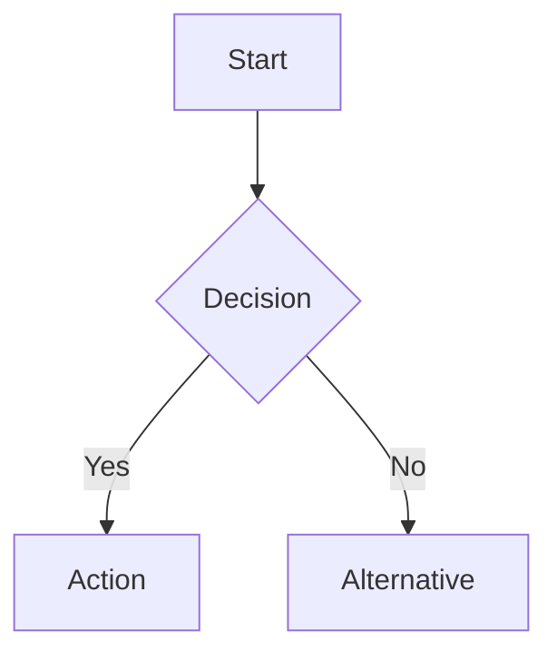
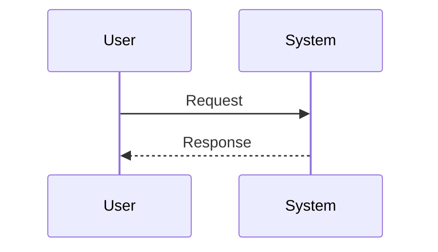
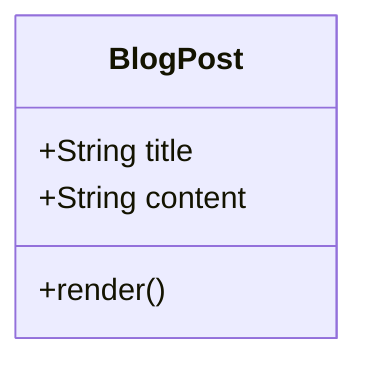
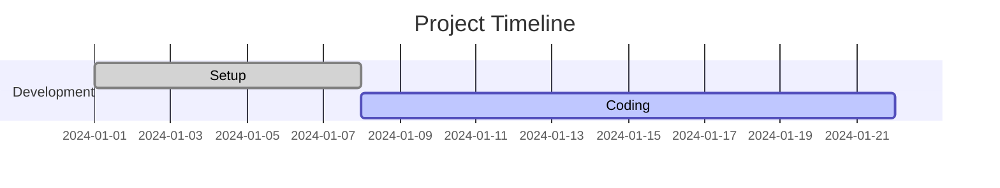

# Max Roald Eckardt's Personal Blog

A Vue.js-based personal website and blog featuring modern web technologies and markdown support with Mermaid diagrams.

## Features

- **Vue 3** with Composition API
- **Vue Router** for navigation
- **Markdown Support** with vue3-markdown-it
- **Mermaid Diagrams** for flowcharts, sequence diagrams, class diagrams, and Gantt charts
- **Responsive Design** with modern CSS
- **GitHub Pages Deployment** ready
- **Jest Testing** framework

## Mermaid Diagram Support

This blog now supports Mermaid diagrams within markdown content. You can create various types of diagrams:

### Supported Diagram Types

1. **Flowcharts**


2. **Sequence Diagrams**


3. **Class Diagrams**


4. **Gantt Charts**


### How to Use Mermaid in Blog Posts

1. **For Markdown Files**: Simply use fenced code blocks with `mermaid` language identifier:
   ```markdown
   ```mermaid
   graph LR
       A --> B
   ```
   ```

2. **Component Configuration**: The MarkdownPost component automatically:
   - Initializes Mermaid with custom theming
   - Renders diagrams after content loads
   - Handles errors gracefully
   - Provides responsive styling

## Development

### Prerequisites
- Node.js 14+
- npm or yarn

### Installation
```bash
npm install
```

### Development Server
```bash
npm run serve
```

### Build for Production
```bash
npm run build
```

### Deploy to GitHub Pages
```bash
npm run deploy
```

### Testing
```bash
npm run test
```

## Project Structure

```
src/
├── components/
│   ├── MarkdownPost.vue    # Handles markdown rendering with Mermaid
│   ├── BlogPost.vue        # Individual blog post display
│   └── posts/              # Vue component-based posts
├── data/
│   └── blogPosts.js        # Blog post metadata and routing
├── views/
│   └── BlogPost.vue        # Blog post view (supports both Vue and markdown)
└── router/
    └── index.js            # Route configuration

public/
└── content/                # Markdown files for blog posts
```

## Adding New Blog Posts

### Option 1: Markdown Files
1. Create a new `.md` file in `public/content/`
2. Add metadata to `src/data/blogPosts.js`:
```javascript
{
  id: 'post-slug',
  title: 'Post Title',
  date: '2024-12-15',
  excerpt: 'Brief description...',
  markdownFile: 'filename.md',
  path: '/blog/post-slug'
}
```

### Option 2: Vue Components
1. Create a new Vue component in `src/components/posts/`
2. Add metadata to `src/data/blogPosts.js`:
```javascript
{
  id: 'post-slug',
  title: 'Post Title',
  date: '2024-12-15',
  excerpt: 'Brief description...',
  component: ComponentName,
  path: '/blog/post-slug'
}
```

## Mermaid Configuration

The Mermaid integration includes:
- Custom theming matching the site's design
- Error handling for invalid diagrams
- Responsive styling for mobile devices
- Automatic re-rendering when content changes

Theme colors are configured to match the site's design:
- Primary: #3498db (blue)
- Secondary: #2c3e50 (dark blue)
- Background: #f8f9fa (light gray)

## License

MIT License - see LICENSE file for details.
