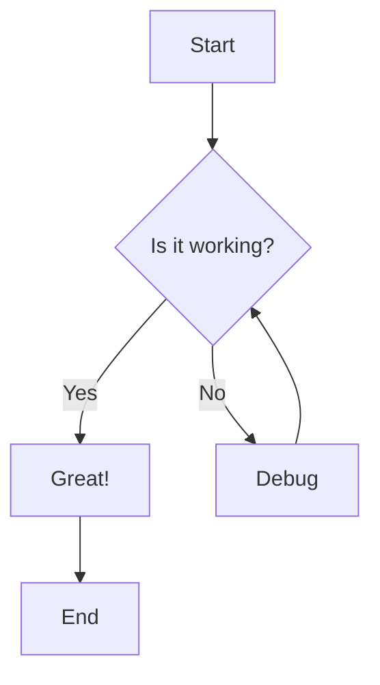
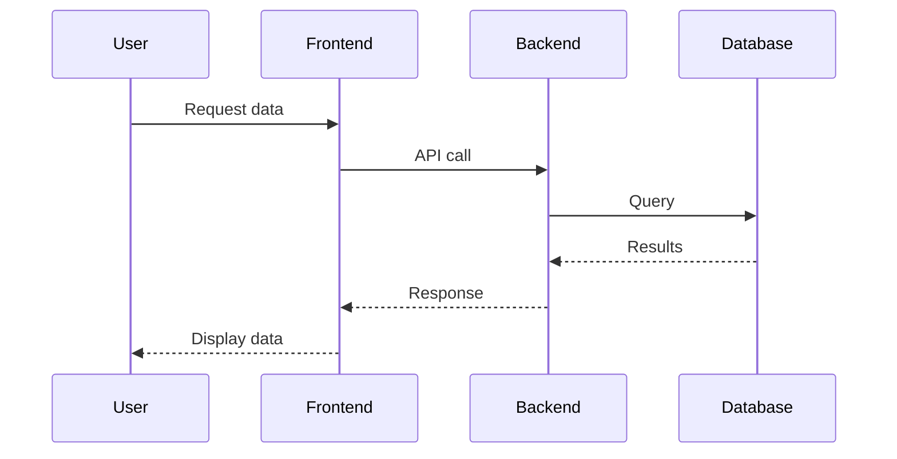
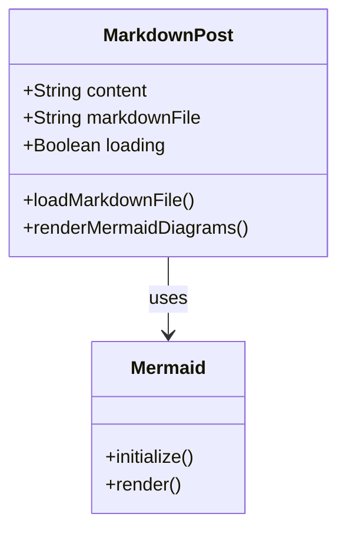
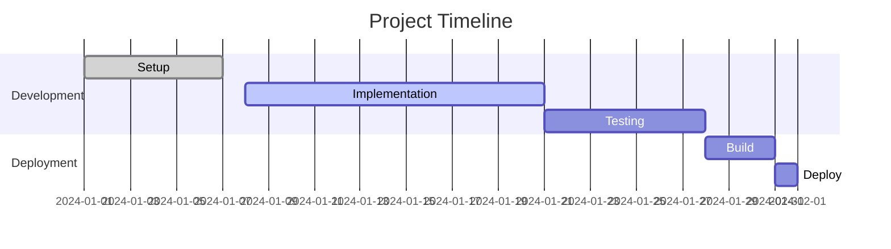

# Mermaid Diagram Test

*December 15, 2024*

This is a test post to demonstrate Mermaid diagram support in the blog.

## Flowchart Example

## Sequence Diagram

## Class Diagram

## Gantt Chart

This demonstrates various types of Mermaid diagrams working within the markdown content system.
